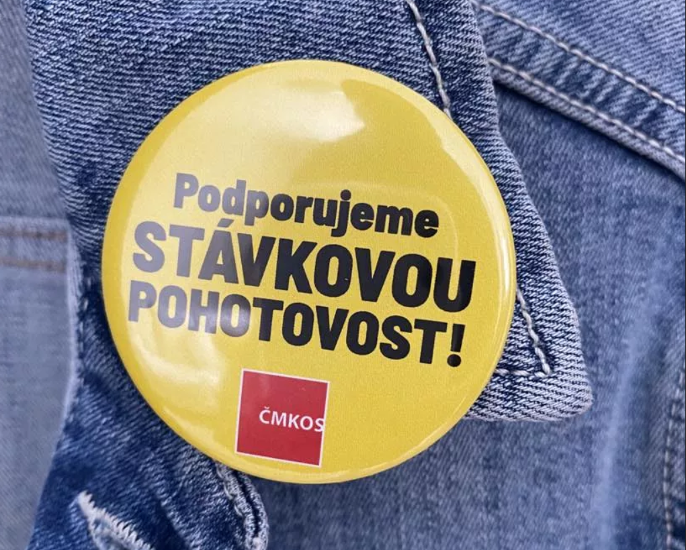

The leadership of the trade union [OSPPP](https://www.osppp.cz) has had badges made for trade unionists who support strike action against the government's austerity package.
ICT union, as a member of the OSPPP, hereby join the call of our parent organisation.

**Letter from the OSPPP President to the affiliated unions:**

> Dear colleagues,
>
> As we have already informed you, the Czech-Moravian Confederation of Trade Unions has on Monday 15 declared a strike emergency. The OSPPP unequivocally supports the strike alert.
>
> The main reasons are the unprecedented impact of the government's “consolidation” package on workers, dissatisfaction with the current way the country is being governed, disagreement with the government's approach, and the failure to conduct dialogue with workers' and employers' representatives. Our aim is to mitigate the impact of the package on workers and their families.
>
> I believe there are members in your ranks who want to show their support. That is why we have had round badges made for you (a separate magnet is included) with the text “We support strike emergency”. Distribution will begin on Friday 16 June 2023.
>
> I am calling on you, the chairmen of the company trade unions, to hand out the badges to those members who realise that just by pinning the badge on their lapel they are making a statement.
>
> Be creative, create photo documentation so that it is clear that it is in support of the members of a particular organization. If you provide us with your imaginative posts, we will use them on social media.
>
> We fight for fair recognition of our work.
>
> Thank you and I look forward to your contributions.
>
> Alena Chlapíková, OSPPP
