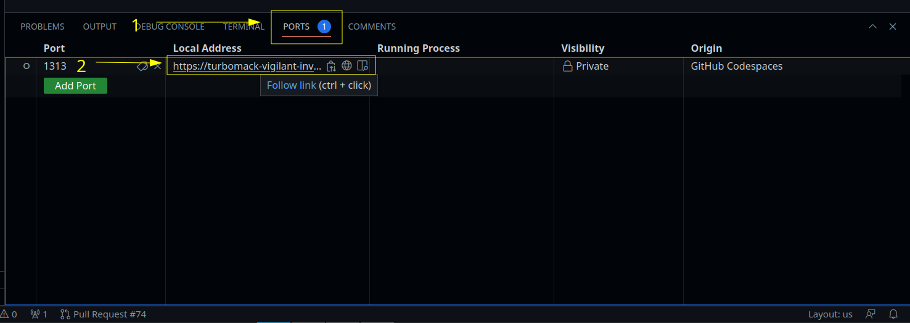

> **_NOTE:_** You must be familiar with the basics of [Git](https://wiki.ictunion.cz/get-started/git.html#git) before you start.

# Codespaces

[Codespaces](https://github.com/features/codespaces) is a GitHub service that provides cloud-based development environments. With Codespaces, you can work on this project without any manual setup on your side.

Codespaces is a premium feature of GitHub, see the [pricing calculator](https://github.com/pricing/calculator).
GitHub offers __60 hours every month for free__ for a 2-core instance per user. 

## Create a new codespace

1. Go to the [main-website](https://github.com/ictunion/main-website) repository and fid the `<> Code` button in the upper-right corner.
2. Click the `<> Code` button, a menu will pop up.
3. Go to the `Codespaces` tab and click `Create codespace on main`.
4. A new window with your codespace will open. 


> **_NOTE:_** Make sure to [stop](#stop-a-codespace) your Codespace instance once you're done working.__

## Run the website server in a codespace

`cs-start` is a script in the root of the repository for starting the `main-website` server. The script configures `hugo` in a way that allows you to use preview features while working in a codespace.

1. Run the script from your codespace terminal:
    ```
    ./cs-start
    ```

    

2. Go to `PORTS` and click the link to open a preview of the website.

    

## Contribute from a codespaces

We use [topic branch](https://git-scm.com/book/en/v2/Git-Branching-Branching-Workflows) workflow in all of our repositories.

### Create a new branch 

* From the terminal:
    ```
    git switch -c <name-of-your-branch>
    ```

* In GUI:

1. Select and hold `Ctrl+Shift+g` or click `Source control`
2. Click the ellipsis (...) -> `Branch` -> `Create Branch`
3. Type the name of your branch.

    

### Make the changes

You can now work on your changes as if in a regular IDE.

Codespaces are based on [Microsoft Visual Studio Code](https://code.visualstudio.com/), so many tips for VS Code are applicable to Codespaces.

See the [Codespaces official documentation](https://docs.github.com/en/codespaces/developing-in-codespaces/developing-in-a-codespace) for a comprehensive overview of features such as [Colaborative editing](https://docs.github.com/en/codespaces/developing-in-codespaces/working-collaboratively-in-a-codespace).

### Commit and push your changes

* From the terminal:
```
    git add <filename>
    git commit -m "My descriptive and useful commit message"
    git push origin <name-of-your-branch>
```

* In the GUI:
    1. In the Activity Bar, click `Source Control`.
    2. Click `+` next to the files you have changed.
    3. Type a commit message that meaingfully decribes your change in the text box.
    4. Click `↓` in the `Commit` button
    5. Select `Commit & Push` from the dropdown menu.

### Open a pull request

See the [Opening a pull request in Codespaces](https://docs.github.com/en/codespaces/developing-in-codespaces/using-github-codespaces-for-pull-requests#opening-a-pull-request-in-codespaces).

## Stop a codespace

1. Open [Codespaces](https://github.com/codespaces).
2. Click the ellipsis (...) next to your codespace.
3. Click `Stop codespace`.

    

## Useful Codespaces resources
* [Official documentation](https://docs.github.com/en/codespaces)
* [Source control](https://docs.github.com/en/codespaces/developing-in-codespaces/using-source-control-in-your-codespace)
* [Pull requests](https://docs.github.com/en/codespaces/developing-in-codespaces/using-github-codespaces-for-pull-requests)
* [Create pull request](https://docs.github.com/en/codespaces/developing-in-codespaces/using-source-control-in-your-codespace#raising-a-pull-request)

