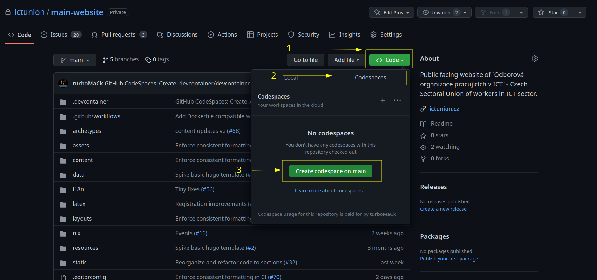
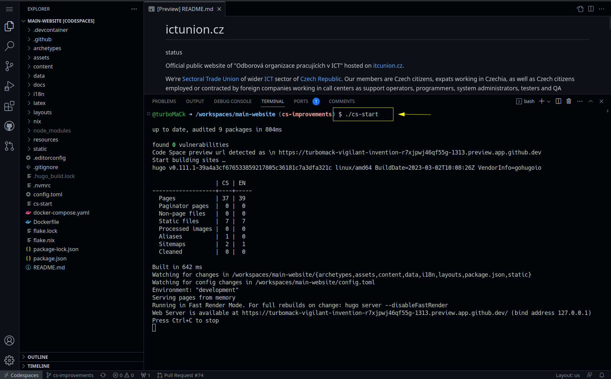
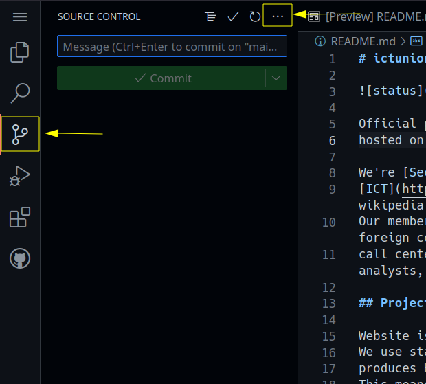
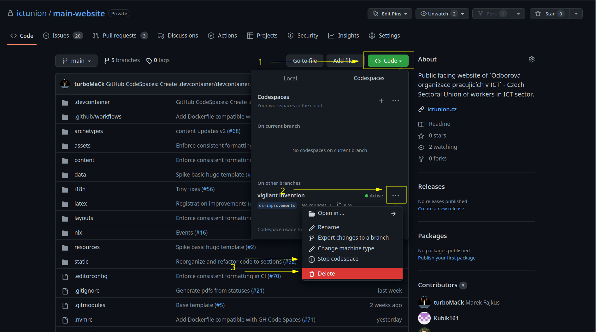

# Codepaces

[Codespaces](https://github.com/features/codespaces) are github service
providing cloud based development evironments.

You can use it to run and work on this project to avoid need for any manual setup on your side.

Code Spaces are premium feature of github. See their [pricing calculator](https://github.com/pricing/calculator).
Anyway Github offers __60 hours every moth for free__ for 2 Core (smallest) instance we're using.

## Create Code Space

On [github](https://github.com/ictunion/main-website) select option to get code in codespaces and crete new:
`<> Code` > `Codespaces` > `Create on main`.

__Don't forget to stop or delete your code space evironment once you're finished!__



## Run In Code Spaces

Use convinient script to run the website server within your code space instance:

```
./cs-start
```

This configures hugo to run with settings that will allow you to use preview features while working within
Codespaces.



To open the preview of the website go to `PORTS` and click on the link:


Codespaces are based on [Microsoft Visual Studio Code](https://code.visualstudio.com/) editor so many tips for VS Code are applicable to Codespaces.

> See [official documentation](https://docs.github.com/en/codespaces/developing-in-codespaces/developing-in-a-codespace)
> for more comprehensive documentation of features of Github Codespaces. It includes features like
> [Colaborative editing](https://docs.github.com/en/codespaces/developing-in-codespaces/working-collaboratively-in-a-codespace)
> and more.

## Contributing from Codespaces

**It's advicable to create a new branch before commiting and pushing any changes.**

In terminal:

```
git checkout -b [name-the-feature]
```

In UI:

- Ctrl+Shift+g or click on Source control
- click on three dots `...`
    - Branch
    - Create Branch
- Type name of the branch


### Pushing Changes and Opening Pull Request

in terminal:

```
git push origin [name-of-branch-in-repository]
```

Then go to [github](https://github.com/ictunion/main-website) and click on button to open the Pull Request.

For UI based flow see [official documentation](https://docs.github.com/en/codespaces/developing-in-codespaces/using-github-codespaces-for-pull-requests#opening-a-pull-request-in-codespaces).



See [official documentation](https://docs.github.com/en/codespaces/developing-in-codespaces/using-source-control-in-your-codespace)
for more detailed information:

- [Source control](https://docs.github.com/en/codespaces/developing-in-codespaces/using-source-control-in-your-codespace)
- [Pull requests](https://docs.github.com/en/codespaces/developing-in-codespaces/using-github-codespaces-for-pull-requests)
- [Create pull request](https://docs.github.com/en/codespaces/developing-in-codespaces/using-source-control-in-your-codespace#raising-a-pull-request)

## Stoping the Codespaces env

After you're done don't forget to either `stop` or `delete` the Codespaces instance:


